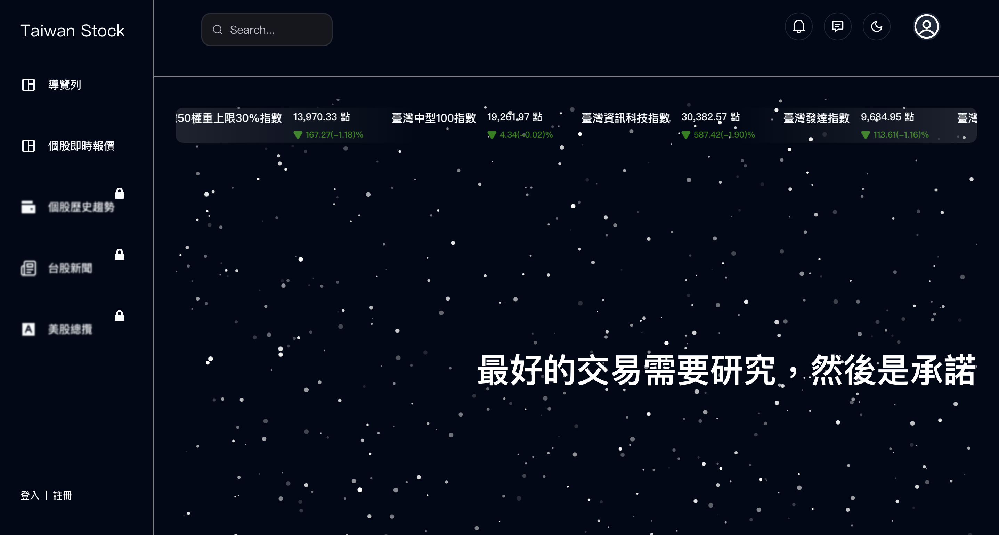
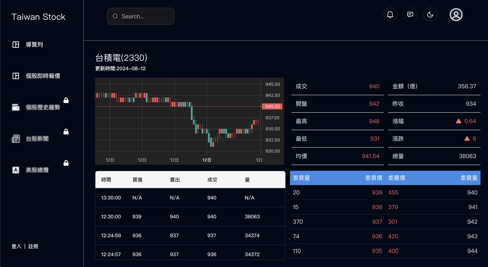

# 台灣股票 Taiwan Stock Project

## Overview

這個專案是基於 React 並串接台灣股票市場 API 顯示資料，及時顯示並給使用者追蹤和分析股票市場

## Demo

## 安裝

1. 複製專案：
   ```sh
   git clone https://github.com/bobokaikai/Taiwan-Stock.git
   cd Taiwan-Stock
   ```
2. 安裝依賴
   ```sh
    npm install
   ```
3. 啟動執行
   ```sh
   npm run dev
   ```
   本機網址運行在 http://localhost:5173/

## Screenshots





## 技術使用

- **Frontend** : React,React Router
- **Styling** : CSS, Tailwind CSS
- **Data Fetching** : Axios, React Query Toolkit
- **Charting** : TradingViewWidget
